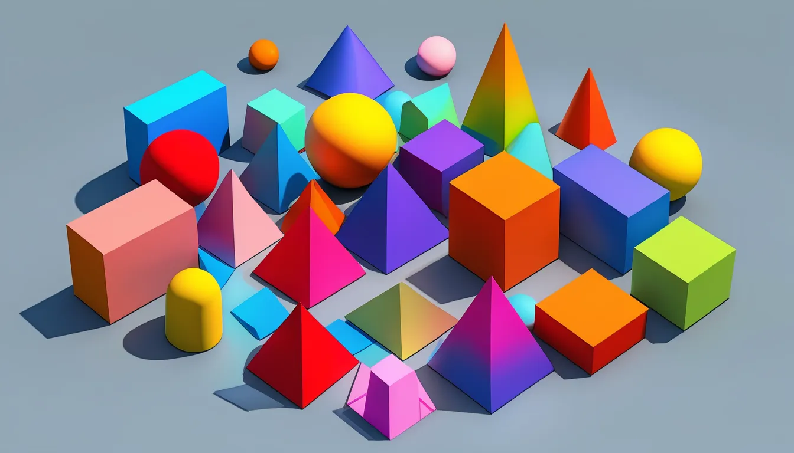

# Geometric Computer Vision Utilities (GCV Utils)



**GCV Utils** is a Python project for processing, manipulating, and visualizing geometric data in computer vision applications. It provides functionalities for handling 3D images and meshes, supporting **SimpleITK**, **VTK**, and **NumPy** data formats. 

## Table of Contents
- [Features](#features)
- [Usage](#usage)
- [Function Documentation](#function-documentation)
  - [SITK Image Processing](#sitk-image-processing)
  - [SITK & VTK Image Handling](#sitk--vtk-image-handling)
  - [VTK Image Processing](#vtk-image-processing)
  - [VTK PolyData Processing](#vtk-polydata-processing)
- [Dependencies](#dependencies)

## Features
- **SITK Image Handling:**
  - Read, write, and convert **SimpleITK** images.
  - Extract metadata such as dimensions, spacing, origin, direction, pixel type, and min-max values.
  - Resample images with adjustable isotropic spacing and interpolation.
  - Visualize **sitk Images** using Matplotlib.

- **VTK Image Processing:**
  - Read, write, and convert **VTK** image formats (`.mhd`, `.mha`, `.vti`, `.vtk`, `.nii`, `.nii.gz`).
  - Convert **NumPy** arrays into VTK images.
  - Extract metadata from **VTK** image data.
  - Visualize **VTK Images** using Matplotlib.

- **VTK PolyData Processing:**
  - Read and write **VTK PolyData** objects (`.obj`, `.stl`, `.vtk`).
  - Convert meshes between different formats.
  - Extract **VTK PolyData** attributes (number of points, number of cells).
  - Convert **VTK PolyData** to NumPy arrays.
  - Generate **VTK PolyData** from **3D coordinate grids** or **VTK images**.
  - Apply **Marching Cubes** to extract a surface from **VTK image data**.
  - Visualize **VTK PolyData** using Matplotlib.

## Installation & Usage

Open your terminal, navigate to the root folder (`gcv_utils`), and run:

```
pip install .
```

You can run the gcv_utils.py script (or import its functions). For example:

```
from gcv_utils import *
import gcv_utils
```

## Function Documentation
### SITK Image Processing
- ```read_sitkimage(image_path: str, verbose: bool = False) -> sitk.Image```
Reads a SimpleITK image from a file.

- ```write_sitkimage(image: sitk.Image, image_path: str, verbose: bool = False) -> None```
Writes a SimpleITK image to a file.

- ```convert_image_format(input_image_path: str, output_image_path: str, verbose: bool = False) -> None```
Converts an image between formats using SimpleITK.

- ```create_sitkimage_from_array(image_array: np.ndarray, image_spacing: tuple, image_origin: tuple) -> sitk.Image```
Creates a SimpleITK image from a NumPy array.

- ```get_min_max_sitkimage(image: sitk.Image) -> tuple[float, float]```
Finds the minimum and maximum intensity values in a SimpleITK image.

- ```describe_detailed_sitkimage(image: sitk.Image, image_name: str = "Image", verbose: bool = False)```
Extracts metadata (dimensions, spacing, origin, direction, pixel type, and min-max values).

- ```create_isotropic_spacing_from_min_spacing_sitkimage(image: sitk.Image) -> tuple[float, float, float]```
Returns isotropic spacing based on the minimum spacing in the image.

- ```resample_sitkimage(image: sitk.Image, output_spacing: tuple, is_label: bool) -> sitk.Image```
Resamples an image to a given spacing, preserving proportions.

- ```resample_sitkimage_from_path(input_image_path: str, output_image_path: str, output_spacing: tuple, is_label: bool, verbose: bool = False) -> None```
Reads, resamples, and saves an image.

- ```resample_and_center_sitkimage(image: sitk.Image, output_size: tuple, output_spacing: tuple, is_label: bool) -> sitk.Image ```
Resizes and centers an image using padding and cropping.

### SITK & VTK Image Handling
- ```get_array_from_image(image) -> np.ndarray```
Converts SimpleITK or VTK ImageData to a NumPy array.

- ```describe_image(image, image_name: str = "Image", verbose: bool = False)```
Returns image dimensions, spacing, and origin.

- ```plot_3D_views(image, image_name: str = "Image", display: bool = False, save: bool = False, output_dir = None) -> None```
Plots the mid-slice views (sagittal, coronal, axial) of a 3D image.

### VTK Image Processing
- ```read_vtkimage(image_path: str, verbose: bool = False) -> vtk.vtkImageData```
Reads a VTK image file.

- ```write_vtkimage(image: vtk.vtkImageData, image_path: str, verbose: bool = False) -> None```
Writes a VTK image file.

- ```create_vtkimage_from_array(image_array: np.ndarray, image_spacing: tuple, image_origin: tuple) -> vtk.vtkImageData```
Converts a NumPy array to VTK ImageData.

### VTK PolyData Processing
- ```read_object(file_path: str, verbose: bool = False) -> vtk.vtkPolyData```
Reads a VTK PolyData object from .obj, .stl, or .vtk files.

- ```write_object(polydata: vtk.vtkPolyData, file_path: str, verbose: bool = False) -> None```
Writes a VTK PolyData object to a file.

- ```convert_object_format(input_file_path: str, output_file_path: str, verbose: bool = False) -> None```
Converts a mesh between different formats.

- ```describe_vtkpolydata(polydata: vtk.vtkPolyData, polydata_name: str = "PolyData", verbose: bool = False)```
Returns the number of points and cells in a VTK PolyData object.

- ```get_array_from_vtkpolydata(polydata: vtk.vtkPolyData)```
Converts VTK PolyData to NumPy arrays.

- ```create_vtkpolydata_from_3Dcoordinates(x: np.ndarray, y: np.ndarray, z: np.ndarray) -> vtk.vtkPolyData```
Generates a VTK PolyData object from 3D coordinate arrays.

- ```create_vtkimage_from_vtkpolydata(polydata: vtk.vtkPolyData, image_size: tuple, image_spacing: tuple, image_origin: tuple) -> vtk.vtkImageData```
Converts a VTK PolyData object into a VTK ImageData object.

- ```create_vtkpolydata_from_vtkImage(image: vtk.vtkImageData, apply_gaussian: bool = False) -> vtk.vtkPolyData```
Applies Marching Cubes to extract a surface from VTK ImageData.

- ```plot_vtkpolydata(polydata: vtk.vtkPolyData, polydata_name: str = "Object", display: bool = False, save: bool = False, output_dir = None, scale: bool = False) -> None```
Plots a VTK PolyData object in 3D.

- ```is_polydata_valid(polydata: vtk.vtkPolyData) -> bool```
Verifies that a VTK polydata object is valid.

- ```decimate_vtkpolydata(polydata: vtk.vtkPolyData, decimation_factor: float) -> vtk.vtkPolyData```
Reduce the number of points in a VTK polydata object using the Quadric Decimation filter.

- ```calculate_chamfer_distance_between_vtkpolydata(polydata1: vtk.vtkPolyData, polydata2: vtk.vtkPolyData) -> float```
Calculate the Chamfer loss between 2 vtkPolyData objects.


## Dependencies
- NumPy: Array computations.
- SimpleITK: Medical image processing.
- VTK: 3D visualization and mesh processing.
- Matplotlib: Plotting and 3D rendering.
